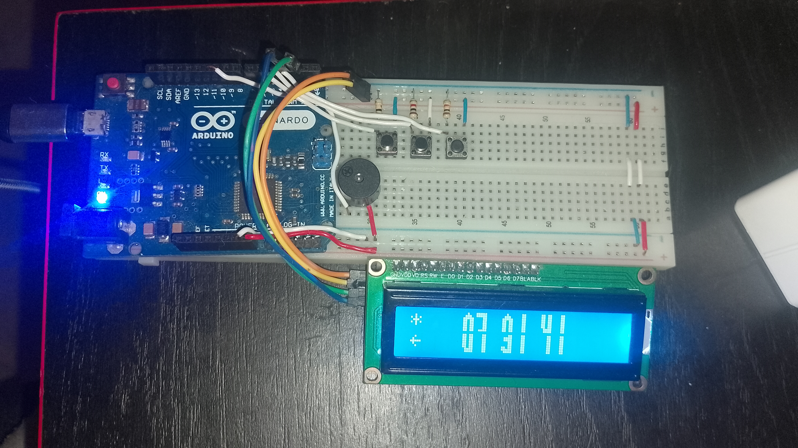
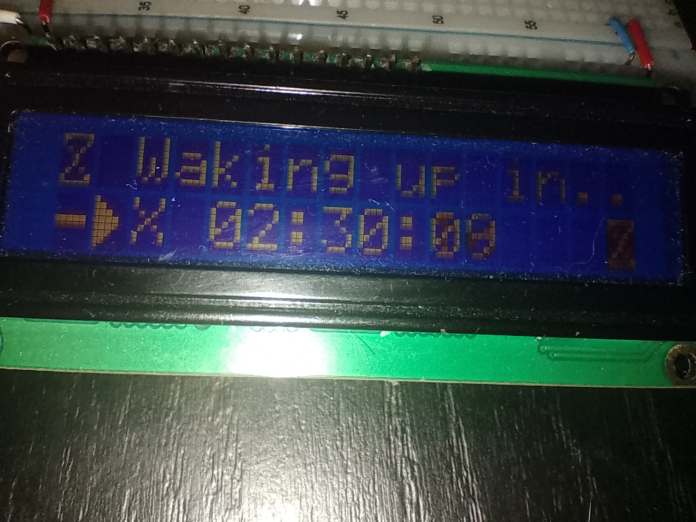

  

<h1 style="text-align: center;">The Owake alarm-clock project.</h1>

##### readme is under construction
I once asked myself, why should I leave my phone far away from me in order to wake up, or even why should I use my phone when there are alarm clocks for that purpose? Better yet, what if I make my own, with my own style and what I know, and make it beautiful?

Owake is a versatile retro alarm, digital clock and chronometer that runs on AVR/Arduino
Aimed at hackers, enthusiasts, or nerds in this field.

##### Demonstration (yt)vvv

> [!IMPORTANT]
> Owake is in an early stage of development, so expect bugs. Contributing to the project is as easy as opening an issue or a pull request.

# How
This program requires a common MCU (Arduino Nano, Uno, Leonardo, Mini, Micro, even Mega), a 16x2 LCD I2C display, 3 push buttons, and a buzzer.
Support for use with a DS3231 will be added soon.

The three buttons are respectively "down, up, ok", with down & up you navigate through modes or select numbers and you proceed with ok

The schematic is located in /resources/schem.png

> [!NOTE]
> The pins equivalent to SDA/SCL on atmega328p (A4, A5) are different on atmega32u4, being 2 and 3.

[Here is a demonstration of an early version of Owake](https://www.youtube.com/watch?v=sRqKA3v0Qh0)

# Compilation
Make sure you have `avr-binutils`, `avr-gcc`, `avr-libc`, `avrdude` On your system and path.
If you are a Windows user you can get them through [MSYS2](https://www.msys2.org/)

Go to the root directory in your terminal and run `make mcu=yourmcu`
`yourmcu` defaults to atmega328p but it can also be atmega32u4.

Once its done the final firmware should be located in build/binaries,
you can upload it to the MCU using `make flash mcu=yourmcu port=mcuport` or any other tool

## Third party licenses
See NOTICE.md

# License
GNU General Public License v3.0

-Marcos.
